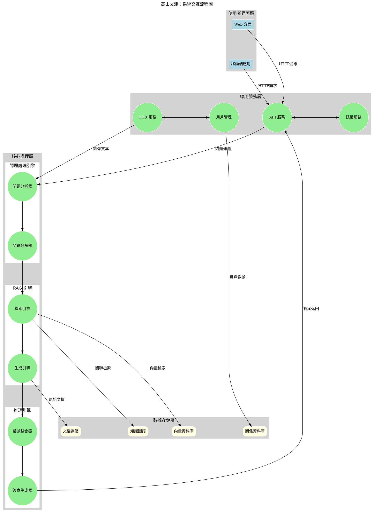
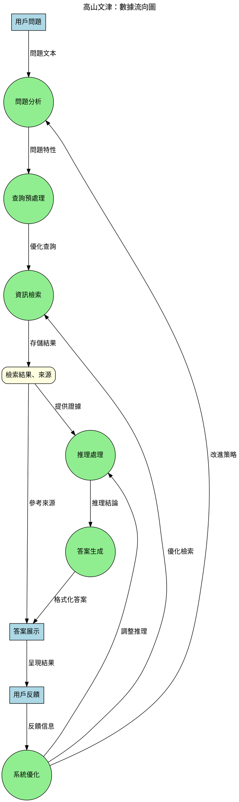
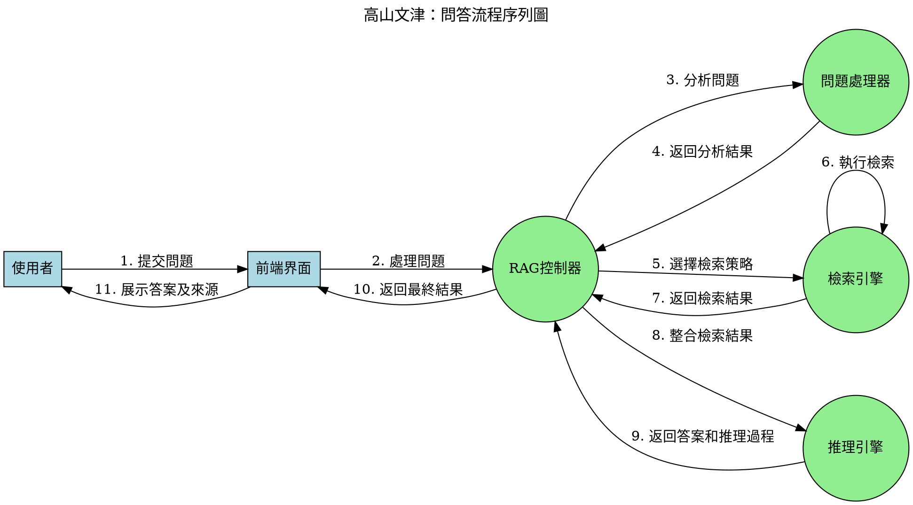

# 高山文津：中學生古漢語知識問答學習系統

## 規劃書

本文件為「高山文津：中學生古漢語知識問答學習系統」之完整系統分析與規劃，基於 LightRAG 架構設計，旨在為中學生打造高效、易用的古漢語學習輔助工具。

---

## 一、系統流程圖

### 1. 整體系統流程

整體系統流程描述了從使用者輸入到系統返回答案的完整過程：

1. **使用者輸入處理**
   - 文字輸入：使用者直接輸入問題
   - 圖像輸入：使用者上傳包含古文文本的圖片
   - 文本解析：系統將圖像轉換為文字，或直接處理文字輸入
   - 問題分解：Agent LLM 會將原問題分解為多個子問題

2. **知識檢索流程 (LightRAG)**
   - 順序檢索：按照子問題的邏輯順序進行檢索
   - 相關度過濾：過濾低相關性的檢索結果，確保資訊質量
   - 證據收集：為每個子問題收集相關證據

3. **推理模型處理**
   - 檢索結果彙整：將所有子問題的檢索結果進行整合
   - 推理分析：基於整合後的資訊進行邏輯推理
   - 答案生成：生成完整、準確的回答

4. **結果呈現**
   - 答案輸出：以易於理解的方式展示答案
   - 推理過程可視化：（可選）顯示系統的思考過程
   - 資訊來源標註：註明答案的參考來源

5. **反饋與優化**
   - 使用者反饋收集：獲取使用者對答案質量的評價
   - 學習記錄：記錄使用者的問題與學習進度
   - 系統優化：基於反饋不斷改進系統表現

### 2. RAG 檢索流程

檢索增強生成（RAG）是系統的核心流程，在Agent LLM分解問題後按子問題順序執行檢索：

1. **子問題處理**
   - 順序安排：基於子問題間的邏輯依賴關係確定處理順序
   - 查詢適配：為每個子問題選擇最適合的檢索策略

2. **查詢預處理**
   - 文本清理：移除無關字符、標點等
   - 關鍵詞提取：識別子問題中的關鍵概念或實體
   - 查詢擴展：增加相關同義詞或相關術語以提高召回率

3. **多策略檢索執行**
   - 選擇性檢索：根據子問題類型選擇適當的檢索方法
   - 語義檢索：基於向量相似度的檢索方法
   - 混合檢索：結合關鍵詞和語義的檢索方法
   - 知識圖譜檢索：利用知識圖譜進行關聯性檢索

4. **檢索結果處理**
   - 相關性評估：評估每條檢索結果與子問題的相關程度
   - 去重與合併：移除重複資訊並整合相關內容
   - 證據標記：標記每條檢索結果與哪個子問題相關

5. **上下文構建**
   - 相關性排序：按相關性排序檢索結果
   - 子問題對應：將檢索結果與對應的子問題關聯
   - 上下文組織：將各子問題的檢索結果組織成結構化上下文
   - 格式化：將上下文轉換為適合推理模型輸入的格式

### 3. 推理模型流程

推理模型處理流程描述了系統如何基於檢索到的資訊進行思考並生成答案：

1. **Agent驅動問題分解**
   - 類型識別：識別問題類型（事實型、解釋型、比較型等）
   - 關鍵實體識別：識別問題中的關鍵實體或概念
   - 子問題生成：Agent LLM將原問題拆分為多個簡單子問題
   - 依賴關係分析：確定子問題間的邏輯依賴關係
   - 處理順序確定：基於依賴關係安排子問題處理順序

2. **順序檢索與證據收集**
   - 按序檢索：依照確定的順序檢索每個子問題
   - 證據評估：評估每條資訊的相關性和可靠性
   - 證據整合：將不同來源的資訊整合為一致的知識基礎

3. **彙整與推理**
   - 檢索結果彙整：將所有子問題的檢索結果統一整合
   - 關聯性分析：分析不同子問題答案間的關聯
   - 矛盾解決：解決可能存在的信息衝突

4. **答案生成**
   - 整體推理：基於彙整的證據進行邏輯推理
   - 答案構建：構建完整、準確的答案
   - 確定性評估：評估答案的確定性程度，必要時標明不確定性

5. **答案優化**
   - 一致性檢查：確保答案內部邏輯一致
   - 完整性檢查：確保答案全面回應了問題
   - 風格調整：根據中學生理解能力調整答案表述方式

### 4. 系統交互流程圖



### 5. 數據流向圖



---

## 二、系統架構圖

### 1. 整體系統架構

系統採用模組化設計，主要分為以下核心組件：

1. **前端介面層**
   - Web 應用介面：基於 Vue.js 的響應式網頁界面
   - 移動端應用：基於 Flutter 的跨平台移動應用
   - 用戶認證模組：處理用戶登入、註冊及權限管理

2. **應用層**
   - 問題處理模組：處理用戶輸入的問題
   - 圖像識別模組：處理圖片輸入並進行OCR識別
   - 推理引擎：基於 LightRAG 的推理系統
   - 結果呈現模組：格式化並呈現系統回答

3. **核心引擎層**
   - RAG 引擎：基於 LightRAG 的檢索增強生成系統
   - 推理模型：處理複雜問題的分解與邏輯推理
   - 知識庫管理：古漢語知識庫的維護與更新

4. **資料儲存層**
   - 向量資料庫：儲存文檔的向量表示
   - 關係資料庫：儲存用戶資料、學習記錄等
   - 文檔儲存：原始文本資料的儲存

5. **基礎設施層**
   - API 服務：RESTful API 和 GraphQL 服務
   - 調度系統：處理任務分配和負載均衡
   - 監控與日誌：系統運行狀態監控和錯誤日誌收集

### 2. 詳細組件架構圖

```
+----------------------------------------------------------------+
|                      前端介面層                                 |
+----------------------------------------------------------------+
|                                                                |
|  +------------------+     +-------------------+                |
|  |     Web前端       |     |    移動端應用     |                |
|  |  +-----------+   |     |  +-----------+   |                |
|  |  | 問答頁面  |   |     |  | 問答頁面  |   |                |
|  |  +-----------+   |     |  +-----------+   |                |
|  |  | 學習進度頁|   |     |  | 拍照識別頁|   |                |
|  |  +-----------+   |     |  +-----------+   |                |
|  |  | 知識探索頁|   |     |  | 離線功能頁|   |                |
|  |  +-----------+   |     |  +-----------+   |                |
|  +------------------+     +-------------------+                |
|                                                                |
+---------------------------|-------------------------------|----+
                            |                               |
+---------------------------|-------------------------------|----+
|                           |                               |    |
|                    RESTful API / GraphQL                  |    |
|                           |                               |    |
+---------------------------|-------------------------------|----+
                            |                               |
+---------------------------|-------------------------------|----+
|                      應用服務層                            |    |
+----------------------------------------------------------------+
|                                                                |
|  +------------------+     +-------------------+                |
|  |   用戶服務        |     |    認證服務       |                |
|  +------------------+     +-------------------+                |
|  |   問題處理服務    |     |    學習記錄服務   |                |
|  +------------------+     +-------------------+                |
|  |   OCR識別服務     |     |    反饋收集服務   |                |
|  +------------------+     +-------------------+                |
|                                                                |
+---------------------------|-------------------------------|----+
                            |                               |
+---------------------------|-------------------------------|----+
|                      核心引擎層                            |    |
+----------------------------------------------------------------+
|                                                                |
|  +---------------------------------------------------+        |
|  |                  推理控制器                       |        |
|  |  +---------------+    +----------------------+   |        |
|  |  | 問題分析器     |    | 查詢參數優化器       |   |        |
|  |  +---------------+    +----------------------+   |        |
|  |  | 問題分解器     |    | 檢索策略選擇器       |   |        |
|  |  +---------------+    +----------------------+   |        |
|  |  | 推理引擎       |    | 結果整合器           |   |        |
|  |  +---------------+    +----------------------+   |        |
|  +---------------------------------------------------+        |
|                             |                                  |
|                             v                                  |
|  +---------------------------------------------------+        |
|  |                    RAG 引擎                       |        |
|  |  +---------------+    +----------------------+   |        |
|  |  | 檢索引擎      |    | 查詢預處理器         |   |        |
|  |  +---------------+    +----------------------+   |        |
|  |  | 向量檢索      |    | 關鍵詞檢索           |   |        |
|  |  +---------------+    +----------------------+   |        |
|  |  | 混合檢索      |    | 知識圖譜檢索         |   |        |
|  |  +---------------+    +----------------------+   |        |
|  +---------------------------------------------------+        |
|                                                                |
+---------------------------|-------------------------------|----+
                            |                               |
+---------------------------|-------------------------------|----+
|                      數據存儲層                            |    |
+----------------------------------------------------------------+
|                                                                |
|  +------------------+     +-------------------+                |
|  |  關係型數據庫    |     |     向量數據庫     |                |
|  |  (PostgreSQL)    |     |   (Milvus/Qdrant)  |                |
|  +------------------+     +-------------------+                |
|  |  緩存數據庫      |     |     知識圖譜       |                |
|  |    (Redis)       |     |      (Neo4j)       |                |
|  +------------------+     +-------------------+                |
|  |  文檔存儲        |     |    內容緩存        |                |
|  +------------------+     +-------------------+                |
|                                                                |
+----------------------------------------------------------------+
```

### 3. 核心技術與接口設計

#### 3.1 主要類及其關係

下面定義了系統中的核心類及其主要方法和關係：

```python
class QuestionProcessor:
    """問題處理器，負責分析和處理用戶問題"""
    
    def analyze_complexity(self, question: str) -> Dict:
        """分析問題複雜度，返回複雜度評估結果"""
    
    def identify_question_type(self, question: str) -> str:
        """識別問題類型（事實、解釋、比較等）"""
    
    def extract_entities(self, question: str) -> List[Dict]:
        """提取問題中的關鍵實體"""
    
    def decompose_question(self, question: str, complexity: Dict) -> List[Dict]:
        """將複雜問題分解為多個子問題"""
    
    def optimize_retrieval_params(self, question: str, question_type: str) -> Dict:
        """根據問題特性優化檢索參數"""


class RetrievalEngine:
    """檢索引擎，負責從知識庫中檢索相關信息"""
    
    def preprocess_query(self, query: str) -> Dict:
        """預處理查詢，進行清理、擴展等操作"""
    
    def semantic_search(self, query: str, params: Dict) -> List[Dict]:
        """基於向量相似度的語義檢索"""
    
    def keyword_search(self, query: str, params: Dict) -> List[Dict]:
        """基於關鍵詞的檢索"""
    
    def hybrid_search(self, query: str, params: Dict) -> List[Dict]:
        """混合檢索策略，結合語義和關鍵詞檢索"""
    
    def knowledge_graph_search(self, entities: List[Dict], params: Dict) -> List[Dict]:
        """基於知識圖譜的關聯檢索"""
    
    def rerank_results(self, results: List[Dict], query: str) -> List[Dict]:
        """對檢索結果進行重排序"""
    
    def filter_results(self, results: List[Dict], threshold: float) -> List[Dict]:
        """過濾低相關性的檢索結果"""


class ReasoningEngine:
    """推理引擎，負責整合信息並生成答案"""
    
    def integrate_evidence(self, evidences: List[Dict]) -> Dict:
        """整合多個來源的證據"""
    
    def resolve_conflicts(self, evidences: List[Dict]) -> Dict:
        """解決證據之間的衝突"""
    
    def generate_answer(self, question: str, integrated_evidence: Dict, 
                       question_type: str) -> Dict:
        """生成答案"""
    
    def evaluate_confidence(self, answer: Dict, evidences: List[Dict]) -> float:
        """評估答案的置信度"""
    
    def format_answer(self, answer: Dict, question_type: str, 
                     user_grade: str) -> Dict:
        """根據用戶年級和問題類型格式化答案"""


class RAGController:
    """RAG控制器，協調問題處理、檢索和推理引擎的工作"""
    
    def __init__(self, question_processor: QuestionProcessor, 
                retrieval_engine: RetrievalEngine, 
                reasoning_engine: ReasoningEngine):
        """初始化各個組件"""
    
    def process_question(self, question: str, user_context: Dict) -> Dict:
        """處理用戶問題的主要入口"""
    
    def process_subquestions(self, subquestions: List[Dict], 
                           retrieval_params: Dict) -> List[Dict]:
        """處理子問題，獲取每個子問題的檢索結果"""
    
    def track_reasoning(self, question: str, subquestions: List[Dict], 
                      retrieval_results: List[Dict], answer: Dict) -> Dict:
        """記錄整個推理過程，用於可視化和解釋"""


class OCRProcessor:
    """OCR處理器，負責處理圖像輸入"""
    
    def extract_text(self, image: bytes) -> str:
        """從圖像中提取文本"""
    
    def correct_text(self, text: str) -> str:
        """校正OCR識別的文本錯誤"""
    
    def format_ancient_text(self, text: str) -> Dict:
        """格式化古文文本，包括斷句、標點等"""


class UserProfileManager:
    """用戶檔案管理器，處理用戶學習數據和個性化設置"""
    
    def get_user_learning_history(self, user_id: str) -> List[Dict]:
        """獲取用戶的學習歷史"""
    
    def update_learning_record(self, user_id: str, question_id: str, 
                             interaction_data: Dict) -> bool:
        """更新用戶的學習記錄"""
    
    def get_learning_recommendations(self, user_id: str) -> List[Dict]:
        """根據用戶學習情況生成推薦"""
    
    def get_user_preferences(self, user_id: str) -> Dict:
        """獲取用戶偏好設置"""
```

#### 3.2 核心流程序列圖

以問答流程為例的序列圖：



### 4. 專案風格與慣例 (Style & Conventions)

#### 命名規則

1. **檔案命名**
   - Python 檔案：小寫字母，使用下劃線分隔，例如 `knowledge_base.py`
   - 前端元件：PascalCase，例如 `QuestionInput.vue`
   - 配置檔案：小寫字母，使用下劃線分隔，例如 `config_prod.json`

2. **變數與函數命名**
   - 變數：小駝峰式命名法 (camelCase)，例如 `userInput`
   - 函數/方法：小駝峰式命名法，例如 `processQuestion()`
   - 常量：全大寫，使用下劃線分隔，例如 `MAX_QUERY_LENGTH`
   - 類：大駝峰式命名法 (PascalCase)，例如 `ReasoningAgent`

3. **資料庫命名**
   - 表名：小寫字母，單數形式，例如 `user`, `question`
   - 欄位名：小寫字母，使用下劃線分隔，例如 `created_at`

#### 檔案結構

```
高山文津/
│
├── frontend/                        # 前端應用
│   ├── web/                         # Web 應用
│   │   ├── components/              # Vue 元件
│   │   │   ├── QuestionInput/       # 問題輸入組件
│   │   │   ├── AnswerDisplay/       # 答案顯示組件
│   │   │   ├── ImageUpload/         # 圖片上傳組件
│   │   │   └── LearningProgress/    # 學習進度組件
│   │   ├── views/                   # 頁面視圖
│   │   ├── store/                   # 狀態管理
│   │   └── assets/                  # 靜態資源
│   │
│   └── mobile/                      # 移動應用
│       ├── lib/                     # Flutter 代碼
│       │   ├── screens/             # 移動端頁面
│       │   ├── widgets/             # 自定義組件
│       │   ├── services/            # API 服務
│       │   └── utils/               # 工具函數
│       └── assets/                  # 應用資源
│
├── backend/                         # 後端服務
│   ├── api/                         # API 定義
│   │   ├── routers/                 # API 路由
│   │   ├── schemas/                 # 請求/響應模型
│   │   └── middleware/              # API 中間件
│   │
│   ├── core/                        # 核心邏輯
│   │   ├── reasoning/               # 推理邏輯
│   │   │   ├── agent.py             # 推理代理
│   │   │   ├── pipeline.py          # 推理管道
│   │   │   ├── cot.py               # 思維鏈推理
│   │   │   ├── models.py            # 推理模型定義
│   │   │   ├── parallel.py          # 並行處理
│   │   │   ├── optimizer.py         # 查詢優化
│   │   │   ├── visualization.py     # 推理可視化
│   │   │   └── tests/               # 推理測試
│   │   │
│   │   ├── retrieval/               # 檢索邏輯
│   │   │   ├── engine.py            # 檢索引擎
│   │   │   ├── preprocessor.py      # 查詢預處理
│   │   │   ├── vector_search.py     # 向量檢索
│   │   │   ├── hybrid_search.py     # 混合檢索
│   │   │   ├── knowledge_graph.py   # 知識圖譜檢索
│   │   │   └── reranker.py          # 結果重排序
│   │   │
│   │   └── rag/                     # RAG 整合
│   │       ├── rag_agent.py         # RAG 代理
│   │       ├── controller.py        # RAG 控制器
│   │       └── adaptive_concurrency.py # 自適應並發
│   │
│   ├── services/                    # 業務服務
│   │   ├── user_service.py          # 用戶服務
│   │   ├── ocr_service.py           # OCR 服務
│   │   ├── learning_service.py      # 學習記錄服務
│   │   └── feedback_service.py      # 反饋收集服務
│   │
│   ├── models/                      # 資料模型
│   │   ├── user.py                  # 用戶模型
│   │   ├── question.py              # 問題模型
│   │   ├── learning_record.py       # 學習記錄模型
│   │   └── feedback.py              # 反饋模型
│   │
│   └── utils/                       # 工具函數
│       ├── text_processor.py        # 文本處理
│       ├── config_manager.py        # 配置管理
│       └── error_handler.py         # 錯誤處理
│
├── data/                            # 數據相關
│   ├── knowledge_base/              # 知識庫資料
│   │   ├── ancient_texts/           # 古代文獻
│   │   ├── annotations/             # 文本註釋
│   │   └── dictionaries/            # 古漢語詞典
│   │
│   ├── vector_store/                # 向量存儲
│   │   ├── embeddings/              # 文本嵌入
│   │   └── indexes/                 # 檢索索引
│   │
│   ├── knowledge_graph/             # 知識圖譜
│   │   ├── entities/                # 實體數據
│   │   └── relationships/           # 關係數據
│   │
│   └── scripts/                     # 資料處理腳本
│       ├── data_import.py           # 數據導入
│       ├── vectorization.py         # 向量化處理
│       └── graph_builder.py         # 圖譜構建
│
├── logs/                            # 日誌
│   ├── api/                         # API 日誌
│   ├── reasoning/                   # 推理日誌
│   └── errors/                      # 錯誤日誌
│
├── tests/                           # 測試
│   ├── unit/                        # 單元測試
│   │   ├── reasoning/               # 推理測試
│   │   ├── retrieval/               # 檢索測試
│   │   └── api/                     # API 測試
│   │
│   ├── integration/                 # 整合測試
│   │   ├── rag_pipeline/            # RAG 管道測試
│   │   └── user_flow/               # 用戶流程測試
│   │
│   └── e2e/                         # 端到端測試
│       ├── web_interface/           # Web 界面測試
│       └── mobile_interface/        # 移動界面測試
│
├── docs/                            # 文檔
│   ├── api/                         # API 文檔
│   ├── user/                        # 用戶指南
│   └── dev/                         # 開發者文檔
│
└── config/                          # 配置文件
    ├── dev/                         # 開發環境配置
    ├── prod/                        # 生產環境配置
    └── settings.py                  # 全局設置
```

#### API 設計原則

1. **RESTful API 設計**
   - 使用資源導向的 URL 設計，例如 `/api/questions/{id}`
   - 正確使用 HTTP 方法：GET (讀取)、POST (新增)、PUT (更新)、DELETE (刪除)
   - 使用 HTTP 狀態碼表示操作結果

2. **請求/響應格式**
   - 請求體和響應體採用 JSON 格式
   - 響應格式統一為：
     ```json
     {
       "success": true/false,
       "data": {...},
       "message": "操作成功/錯誤信息",
       "code": 0/錯誤代碼
     }
     ```

3. **API 版本控制**
   - 在 URL 中包含版本號，例如 `/api/v1/questions`
   - 主要版本更新時，遞增版本號

#### 程式碼風格

1. **Python 程式碼風格**
   - 遵循 PEP 8 規範
   - 使用類型註解增加代碼可讀性
   - 使用 Google 風格的文檔字符串

2. **JavaScript/TypeScript 程式碼風格**
   - 遵循 ESLint 與 Prettier 規範
   - 優先使用 ES6+ 特性
   - 使用 JSDoc 註釋

3. **錯誤處理**
   - 使用特定的錯誤類別區分不同類型的錯誤
   - 詳細記錄錯誤信息，包括錯誤發生的上下文
   - 對用戶友好的錯誤信息，適合中學生理解

---

## 三、資料模型設計

### 1. 資料庫架構

本系統採用混合式資料庫設計，包含關聯式資料庫、向量資料庫與知識圖譜三大部分，以滿足不同類型資料的存儲與檢索需求。

#### 1.1 關聯式資料庫 (PostgreSQL)

主要用於存儲結構化數據，包括用戶信息、學習記錄、問答歷史等。

##### 主要資料表設計

1. **用戶表 (User)**
```sql
CREATE TABLE users (
    user_id SERIAL PRIMARY KEY,
    username VARCHAR(50) NOT NULL UNIQUE,
    password_hash VARCHAR(255) NOT NULL,
    email VARCHAR(100) UNIQUE,
    user_type VARCHAR(20) NOT NULL CHECK (user_type IN ('student', 'teacher', 'admin')),
    grade VARCHAR(20) NOT NULL, -- 學生年級，如'初一'、'高二'等
    created_at TIMESTAMP WITH TIME ZONE DEFAULT CURRENT_TIMESTAMP,
    last_login TIMESTAMP WITH TIME ZONE,
    is_active BOOLEAN DEFAULT TRUE,
    profile_image_url VARCHAR(255),
    preferences JSONB -- 用戶偏好設置，如界面主題、答案顯示方式等
);
```

2. **問題記錄表 (Question)**
```sql
CREATE TABLE questions (
    question_id SERIAL PRIMARY KEY,
    user_id INTEGER NOT NULL REFERENCES users(user_id),
    question_text TEXT NOT NULL,
    question_type VARCHAR(50) NOT NULL, -- 如'解釋型'、'比較型'、'事實型'等
    complexity_level INTEGER CHECK (complexity_level BETWEEN 1 AND 5),
    image_url VARCHAR(255), -- 若問題來自圖片
    created_at TIMESTAMP WITH TIME ZONE DEFAULT CURRENT_TIMESTAMP,
    source VARCHAR(50) NOT NULL DEFAULT 'text', -- 'text'或'image'
    status VARCHAR(20) DEFAULT 'answered' -- 問題狀態：pending, answered, failed
);
```

3. **答案記錄表 (Answer)**
```sql
CREATE TABLE answers (
    answer_id SERIAL PRIMARY KEY,
    question_id INTEGER NOT NULL REFERENCES questions(question_id),
    answer_text TEXT NOT NULL,
    confidence_score DECIMAL(5,4),
    processing_time INTEGER, -- 處理時間（毫秒）
    sources JSONB, -- 引用的資料來源
    created_at TIMESTAMP WITH TIME ZONE DEFAULT CURRENT_TIMESTAMP,
    reasoning_path JSONB, -- 儲存推理路徑
    feedback_score INTEGER -- 用戶對答案的評分（1-5）
);
```

4. **學習記錄表 (LearningRecord)**
```sql
CREATE TABLE learning_records (
    record_id SERIAL PRIMARY KEY,
    user_id INTEGER NOT NULL REFERENCES users(user_id),
    question_id INTEGER REFERENCES questions(question_id),
    session_id VARCHAR(100), -- 學習會話ID
    activity_type VARCHAR(50) NOT NULL, -- 'question', 'reading', 'review'等
    content_reference JSONB, -- 引用的知識點
    time_spent INTEGER, -- 花費時間（秒）
    created_at TIMESTAMP WITH TIME ZONE DEFAULT CURRENT_TIMESTAMP,
    difficulty_level INTEGER CHECK (difficulty_level BETWEEN 1 AND 5),
    performance_score DECIMAL(5,2) -- 學習表現評分
);
```

5. **知識點表 (KnowledgePoint)**
```sql
CREATE TABLE knowledge_points (
    knowledge_id SERIAL PRIMARY KEY,
    title VARCHAR(100) NOT NULL,
    category VARCHAR(50) NOT NULL, -- 如'字詞'、'句法'、'文體'等
    difficulty_level INTEGER CHECK (difficulty_level BETWEEN 1 AND 5),
    grade_level VARCHAR(20) NOT NULL, -- 適用年級
    content TEXT NOT NULL,
    examples JSONB, -- 包含示例
    related_points INTEGER[], -- 相關知識點ID
    created_at TIMESTAMP WITH TIME ZONE DEFAULT CURRENT_TIMESTAMP,
    updated_at TIMESTAMP WITH TIME ZONE DEFAULT CURRENT_TIMESTAMP
);
```

6. **反饋表 (Feedback)**
```sql
CREATE TABLE feedback (
    feedback_id SERIAL PRIMARY KEY,
    user_id INTEGER NOT NULL REFERENCES users(user_id),
    question_id INTEGER REFERENCES questions(question_id),
    answer_id INTEGER REFERENCES answers(answer_id),
    rating INTEGER CHECK (rating BETWEEN 1 AND 5),
    feedback_text TEXT,
    created_at TIMESTAMP WITH TIME ZONE DEFAULT CURRENT_TIMESTAMP,
    issue_type VARCHAR(50), -- 如'不准確'、'不完整'、'不清楚'等
    is_processed BOOLEAN DEFAULT FALSE
);
```

7. **系統日誌表 (SystemLog)**
```sql
CREATE TABLE system_logs (
    log_id SERIAL PRIMARY KEY,
    log_level VARCHAR(20) NOT NULL, -- 'INFO', 'WARNING', 'ERROR', 'CRITICAL'
    component VARCHAR(50) NOT NULL, -- 如'rag_engine', 'reasoning_model'等
    message TEXT NOT NULL,
    details JSONB,
    timestamp TIMESTAMP WITH TIME ZONE DEFAULT CURRENT_TIMESTAMP,
    user_id INTEGER REFERENCES users(user_id),
    request_id VARCHAR(100)
);
```

#### 1.2 向量資料庫 (Milvus/Qdrant)

用於存儲和檢索文本的向量表示，支持語義搜索功能。

##### 向量集合設計

1. **文檔向量集合 (document_vectors)**
   - 存儲古漢語文獻、教材、解釋等文本的向量表示
   - 每條記錄包含：
     - ID: 唯一標識符
     - Vector: 文本嵌入向量 (1536維，OpenAI ada-002模型)
     - Text: 原始文本內容
     - Metadata: 包含文檔來源、類型、難度等資訊的JSON
     - Document_id: 關聯到原始文檔的ID
     - Chunk_id: 若為文檔分塊，則有分塊ID

2. **知識點向量集合 (knowledge_vectors)**
   - 存儲古漢語知識點的向量表示
   - 每條記錄包含：
     - ID: 唯一標識符
     - Vector: 知識點嵌入向量
     - Content: 知識點內容
     - Metadata: 包含知識點類型、難度、適用年級等資訊
     - Knowledge_id: 關聯到知識點表的ID

3. **問題向量集合 (question_vectors)**
   - 存儲歷史問題的向量表示，用於相似問題檢索
   - 每條記錄包含：
     - ID: 唯一標識符
     - Vector: 問題嵌入向量
     - Question: 問題文本
     - Metadata: 問題類型、複雜度等
     - Question_id: 關聯到問題表的ID

#### 1.3 知識圖譜 (Neo4j)

用於存儲古漢語概念間的關係，支持關聯性檢索與推理。

##### 主要節點與關係設計

1. **節點類型**
   - Person: 歷史人物，如作者、歷史人物等
   - Work: 文學作品、典籍等
   - Concept: 古漢語概念、詞彙
   - Grammar: 語法結構
   - Dynasty: 朝代
   - Event: 歷史事件
   - Place: 地點

2. **關係類型**
   - WROTE: 人物與作品間的創作關係
   - BELONGS_TO: 作品屬於某朝代或流派
   - CONTAINS: 作品包含某概念或語法
   - INFLUENCES: 概念或作品間的影響關係
   - EXPLAINS: 概念間的解釋關係
   - LIVED_IN: 人物生活的朝代
   - HAPPENED_IN: 事件發生的朝代或地點
   - RELATED_TO: 概念間的相關性
   - SYNONYM_OF: 同義關係
   - ANTONYM_OF: 反義關係
   - PART_OF: 組成關係

### 2. 資料模型關聯圖

關聯式資料庫的主要表之間存在以下關聯：

- User (1) -> (*) Question: 一個用戶可提出多個問題
- Question (1) -> (1) Answer: 一個問題對應一個答案
- User (1) -> (*) LearningRecord: 一個用戶有多個學習記錄
- Question (1) -> (*) LearningRecord: 一個問題可以關聯多個學習記錄
- User (1) -> (*) Feedback: 一個用戶可提供多條反饋
- Answer (1) -> (*) Feedback: 一個答案可以收到多條反饋

### 3. 向量存儲方案設計

本系統採用混合式向量存儲與檢索策略，以提高檢索效率與準確性。

#### 3.1 向量化策略

1. **分塊策略**
   - 長文本採用重疊式分塊 (Overlapping Chunks)，每塊約500-700字
   - 分塊重疊率設定為10-15%，確保上下文連貫性
   - 專用知識點採用整體向量化，不進行分塊

2. **向量化模型選擇**
   - 主要使用 OpenAI ada-002 模型 (1536維)
   - 對於古文特有表達，增加專門的古漢語預處理步驟

3. **多模態向量化**
   - 對具有圖片的內容實施文本+圖像聯合向量化
   - 使用 CLIP 或類似模型處理圖像部分

#### 3.2 索引結構設計

1. **主索引**
   - 採用 HNSW (Hierarchical Navigable Small World) 索引
   - 配置參數：M=16, ef_construction=200, ef_search=100

2. **分類索引**
   - 按知識領域建立子索引 (如文學作品、語法、歷史背景等)
   - 實施向量聚類，加快檢索速度

3. **混合檢索架構**
   - 實施兩階段檢索：粗檢索 + 精確重排序
   - 集成關鍵詞過濾以提高相關性

#### 3.3 緩存策略

1. **熱門查詢緩存**
   - 緩存常見問題的檢索結果
   - LRU (Least Recently Used) 策略管理緩存

2. **用戶個性化緩存**
   - 根據用戶最近查詢模式調整緩存策略
   - 學習進度相關內容優先緩存

3. **向量緩存**
   - 緩存用戶提問的向量表示，避免重複計算
   - 批量處理向量化請求，提高效率

---

## 四、介面設計

### 1. 系統介面概述

本系統主要提供Web介面和移動應用兩種介面，並保持兩者之間的一致性和資料同步。介面設計遵循直觀、簡潔和易用的原則，特別適合中學生使用。

### 2. Web 介面設計

#### 2.1 首頁設計

首頁作為用戶進入系統的第一個頁面，需要簡潔明了地展示系統功能。

**主要元素**:
- 頂部導航欄：包含「首頁」、「問答系統」、「學習進度」、「知識探索」、「個人設置」等導航項
- 搜尋欄：大型居中設計，便於用戶直接輸入問題
- 功能區塊：展示系統核心功能，如「文字問答」、「圖像識別問答」、「智能學習導航」等
- 學習資源推薦：根據用戶歷史和年級推薦適合的古漢語學習資源
- 快捷操作區：提供最近問題記錄、常見問題等快捷入口

**設計特點**:
- 採用卡片式設計，清晰區分不同功能模塊
- 使用柔和的傳統中國風配色，但保持現代感，適合中學生審美
- 重要功能使用醒目按鈕強調，引導用戶操作
- 響應式設計，適配不同尺寸的設備

#### 2.2 問答頁面設計

問答頁面是系統的核心功能頁面，需兼顧使用便捷性和資訊展示完整性。

**主要元素**:
- 問題輸入區：大型文本框，支持富文本輸入
- 上傳圖片按鈕：允許用戶上傳含有古文的圖片進行識別
- 歷史問題側邊欄：展示用戶最近的問題歷史
- 答案展示區：清晰展示系統回答，包含原文引用、註釋解釋等
- 資料來源區：顯示回答所基於的參考資料來源
- 反饋按鈕：用戶可對答案給予評分和反饋
- 相關問題推薦：基於當前問題推薦相關的延伸問題

**交互流程**:
1. 用戶輸入問題或上傳圖片
2. 系統顯示載入動畫，同時可能展示推理進度
3. 回答生成後，分段呈現，先顯示核心答案，然後是詳細解釋
4. 用戶可展開查看推理過程和參考資料
5. 用戶可對答案進行評分和反饋

#### 2.3 學習進度頁面設計

此頁面幫助用戶追蹤自己的學習軌跡和進展。

**主要元素**:
- 學習概覽：以儀表板形式展示學習統計數據，包括問題總數、學習時長、掌握知識點等
- 知識地圖：以視覺化方式展示用戶已學習的知識點及其關聯
- 學習日曆：顯示用戶每日學習活動的熱力圖
- 弱項分析：識別用戶尚未掌握的知識點，並提供針對性建議
- 學習記錄列表：詳細記錄每次學習活動，包括問題、答案和時間

**設計特點**:
- 採用豐富的數據可視化組件，直觀呈現學習數據
- 提供多維度的學習進度分析
- 根據用戶年級和學習目標，設置適合的進度指標

#### 2.4 知識探索頁面設計

提供結構化的古漢語知識瀏覽功能，幫助用戶系統性學習。

**主要元素**:
- 知識分類導航：按文學作品、字詞解釋、語法結構等分類
- 知識卡片：以卡片形式展示知識點，包含簡要描述和示例
- 搜索過濾器：根據年級、難度、知識類型等篩選知識點
- 知識關係圖：視覺化展示知識點之間的關聯
- 學習建議：根據用戶學習記錄推薦適合學習的知識點

**交互特點**:
- 支持知識點間的關聯跳轉，形成學習網絡
- 每個知識點可展開查看詳細解釋和例句
- 提供「添加到學習計劃」功能，便於規劃學習

### 3. 移動應用介面設計

移動應用介面需要在保持功能完整性的同時，適應移動設備的特性。

#### 3.1 移動首頁設計

**主要元素**:
- 底部導航欄：替代Web版的頂部導航，包含「首頁」、「問答」、「拍照」、「學習」、「我的」
- 簡化版搜索欄：位於頁面上方
- 功能卡片：排列主要功能入口
- 下拉刷新：更新推薦內容和學習進度

**設計特點**:
- 操作元素尺寸適合手指點擊
- 單手操作友好，重要功能在拇指可及範圍
- 垂直滾動設計，減少橫向導航

#### 3.2 拍照識別頁面設計

移動應用特有的功能頁面，便於用戶直接拍攝古文文本進行識別和解答。

**主要元素**:
- 相機取景框：清晰提示拍攝區域
- 拍攝指引：幫助用戶獲得清晰的文本圖像
- 閃光燈控制：適應不同光線條件
- 歷史記錄：顯示近期拍攝識別的內容
- 手動調整區：允許用戶裁剪和調整圖像

**交互流程**:
1. 用戶進入拍照頁面，系統啟動相機
2. 用戶對準古文文本拍攝
3. 系統識別文本並提示確認
4. 用戶確認或調整識別結果
5. 系統基於識別文本生成解答

#### 3.3 離線功能頁面設計

支持用戶在無網絡環境下使用基本功能。

**主要元素**:
- 已下載內容列表：顯示可離線使用的學習內容
- 下載管理：管理待下載和已下載的內容
- 離線問答：基於已下載內容的有限問答功能
- 同步狀態：顯示本地數據與雲端的同步狀態

### 4. 用戶流程圖設計

#### 4.1 文本問答流程

1. 用戶登入系統
2. 進入問答頁面
3. 輸入古漢語相關問題
4. 系統分析問題並檢索相關信息
5. 系統生成並展示答案
6. 用戶查看答案，可能展開詳細解釋或參考來源
7. 用戶對答案提供反饋
8. 系統記錄問答互動並更新用戶學習記錄
9. 系統推薦相關問題或知識點

#### 4.2 圖像識別問答流程

1. 用戶進入拍照/上傳頁面
2. 拍攝或上傳包含古文的圖片
3. 系統進行OCR識別，提取文本
4. 系統顯示識別結果，用戶確認或調整
5. 用戶選擇問題類型（全文解釋、字詞解釋、語法分析等）
6. 系統基於識別文本和問題類型生成答案
7. 用戶查看答案並提供反饋
8. 系統記錄互動並更新學習記錄

#### 4.3 知識探索流程

1. 用戶進入知識探索頁面
2. 瀏覽知識分類或搜索特定知識點
3. 選擇感興趣的知識點查看詳情
4. 系統展示知識點的詳細解釋、例句和相關知識
5. 用戶可繼續探索關聯知識點
6. 用戶可將知識點添加到學習計劃
7. 系統記錄瀏覽行為並更新推薦

### 5. 響應式設計原則

1. **彈性布局**
   - 使用flex和grid佈局，適應不同屏幕尺寸
   - 關鍵內容優先顯示，次要內容在小屏幕上可折疊

2. **斷點設計**
   - 大屏桌面 (>1200px)：完整功能佈局
   - 中等屏幕 (768px-1200px)：調整元素大小和佈局
   - 移動設備 (<768px)：單列佈局，簡化導航

3. **字體適應**
   - 使用相對單位(rem, em)設置字體大小
   - 確保古漢語文本在各尺寸設備上清晰可讀

4. **觸控優化**
   - 移動設備上增大可點擊區域
   - 支持常見觸控手勢操作

---

## 五、安全與集成設計

### 1. 資料安全策略設計

#### 1.1 使用者認證與授權

1. **多重認證機制**
   - 基本使用者名稱/密碼驗證
   - 支持第三方登入 (Google, 微信等)
   - 可選雙因素認證 (2FA)，特別是管理員帳戶

2. **基於角色的權限管理**
   - 學生角色：基本問答和學習功能
   - 教師角色：查看學生進度、創建學習規劃等附加功能
   - 管理員角色：系統管理和數據維護權限
   - 家長角色：查看特定學生的學習狀況

3. **訪問控制策略**
   - 實施最小權限原則
   - API 級別的權限控制
   - 資源基礎的訪問控制 (RBAC)
   - 定期權限審核機制

#### 1.2 數據傳輸安全

1. **傳輸加密**
   - 全站 HTTPS/TLS 1.3 實施
   - 敏感數據採用額外加密層
   - API 通信使用令牌認證

2. **API 安全**
   - 實施 API 限流防止濫用
   - 請求簽名驗證
   - CORS (跨域資源共享) 配置限制
   - API 版本控制策略

3. **移動端安全**
   - 客戶端證書固定 (Certificate Pinning)
   - 本地存儲數據加密
   - 安全應用間通信

#### 1.3 數據存儲安全

1. **數據加密**
   - 敏感用戶資料 (如密碼) 使用強散列算法 (bcrypt/Argon2)
   - 儲存的個人資料採用數據庫層級加密
   - 靜態數據加密

2. **數據隔離**
   - 不同客戶/學校的數據實現邏輯隔離
   - 敏感數據與一般數據分離存儲
   - 開發/測試/生產環境數據嚴格分離

3. **備份與恢復**
   - 自動定時備份機制
   - 備份數據加密存儲
   - 災備與復原測試規程
   - 冷備份與熱備份結合策略

#### 1.4 漏洞管理

1. **安全編碼實踐**
   - 輸入驗證與處理
   - 防SQL注入、XSS、CSRF等常見攻擊
   - 依賴庫定期更新管理

2. **定期安全審計**
   - 代碼安全審計
   - 滲透測試
   - 漏洞掃描
   - 第三方安全評估

3. **漏洞響應流程**
   - 安全問題報告渠道
   - 漏洞嚴重度評估標準
   - 修補與部署流程
   - 事後分析與預防機制

#### 1.5 合規與隱私

1. **隱私保護設計**
   - 數據收集最小化原則
   - 明確的用戶隱私聲明與同意機制
   - 資料匿名化處理機制
   - 未成年人特殊保護措施

2. **監管合規**
   - 符合教育系統數據安全規範
   - 個人信息保護法合規
   - 數據留存與刪除策略

### 2. LightRAG與其他組件整合方案

#### 2.1 LightRAG整合架構

LightRAG作為系統的核心檢索增強生成引擎，需要與其他系統組件緊密整合。整合架構如下：

1. **模組化接口設計**
   - 定義標準化的輸入/輸出接口
   - 使用適配器模式應對不同組件的接口差異
   - 提供可配置的參數調整機制

2. **事件驅動集成**
   - 採用事件驅動架構實現鬆耦合整合
   - 使用消息隊列處理組件間通信
   - 定義關鍵事件類型與處理流程

3. **資源管理策略**
   - 連接池管理數據庫連接
   - 緩存共享與同步機制
   - 請求批處理優化

### 3. 系統容錯與恢復機制設計

#### 3.1 錯誤處理策略

1. **分級錯誤處理**
   - 致命錯誤：需立即人工干預的系統故障
   - 嚴重錯誤：影響主要功能但系統仍可運行
   - 一般錯誤：影響有限，可自動恢復
   - 警告：不影響功能但需要關注

2. **用戶錯誤處理**
   - 提供友好的錯誤提示，適合中學生理解
   - 對常見錯誤提供引導性解決方案
   - 錯誤追蹤與用戶反饋結合

3. **系統錯誤處理**
   - 全局錯誤捕獲機制
   - 詳細錯誤日誌記錄
   - 關鍵操作事務處理
   - 非阻塞式故障處理

#### 3.2 故障預防機制

1. **健康檢查**
   - 定期組件健康檢查
   - 關鍵指標監控與預警
   - 依賴服務可用性檢測

2. **負載管理**
   - 動態負載均衡
   - 請求限流與降級
   - 資源使用監控與擴展策略

3. **預防性維護**
   - 定期系統檢查與優化
   - 數據庫維護計劃
   - 緩存清理與重建策略

#### 3.3 容錯設計

1. **服務降級策略**
   - 定義功能重要性級別
   - 高峰期非核心功能自動降級
   - 資源受限時的優先級調整

2. **冗餘設計**
   - 關鍵服務多實例部署
   - 數據多副本存儲
   - 多區域備份策略

3. **隔離機制**
   - 故障隔離設計
   - 服務熔斷器模式
   - 資源使用隔離

#### 3.4 恢復機制

1. **自動恢復流程**
   - 服務自動重啟機制
   - 集群節點自動恢復
   - 數據一致性修復

2. **數據恢復策略**
   - 時間點恢復能力
   - 增量備份與全量備份結合
   - 多級數據恢復選項

3. **災難恢復**
   - 完整災難恢復流程
   - 離線模式應急策略
   - 數據中心故障切換機制

#### 3.5 監控與報警

1. **全面監控系統**
   - 服務健康監控
   - 性能與資源監控
   - 用戶體驗監控

2. **智能報警機制**
   - 多級別報警策略
   - 報警聚合與降噪
   - 自動化響應與人工介入結合

3. **可觀測性設計**
   - 分布式追蹤
   - 詳細日誌記錄
   - 性能指標採集
   - 可視化監控儀表板

這些機制共同保障系統的穩定運行，確保即使在部分組件故障的情況下，系統仍能提供核心功能，並能快速恢復正常運行。

---

## 六、專案甘特圖

### 第一階段：需求分析與規劃（1個月）

1. **需求分析**（2週）
   - 使用者需求調研
   - 競品分析
   - 核心功能定義

2. **系統設計**（2週）
   - 系統架構設計
   - 資料模型設計
   - API 設計
   - UI/UX 設計

### 第二階段：基礎設施搭建（1個月）

1. **開發環境搭建**（1週）
   - 版本控制設置
   - 開發環境配置
   - CI/CD 流程建立

2. **後端基礎架構**（2週）
   - 資料庫設計與實現
   - API 服務框架搭建
   - 認證系統實現

3. **前端基礎架構**（1週）
   - 前端項目結構搭建
   - 全局樣式與元件庫設置
   - 路由與導航實現

### 第三階段：核心功能開發（3個月）

1. **知識庫建設**（3週）
   - 古漢語資料收集與整理
   - 文檔處理管道開發
   - 向量化與索引建立

2. **RAG 引擎開發**（4週）
   - LightRAG 整合與適配
   - 檢索策略優化
   - 混合檢索實現

3. **推理模型開發**（3週）
   - 問題分析模組實現
   - 問題分解與整合邏輯開發
   - 推理可視化設計

4. **問答系統整合**（2週）
   - 問題處理流程實現
   - 回答生成與格式化
   - 來源引用機制開發

### 第四階段：使用者界面開發（1.5個月）

1. **Web 前端開發**（3週）
   - 主問答界面實現
   - 學習進度與統計功能
   - 知識瀏覽功能

2. **移動端開發**（3週）
   - 移動應用框架搭建
   - 拍照識別功能實現
   - 核心功能移植

### 第五階段：系統整合與測試（1.5個月）

1. **系統整合**（2週）
   - 前後端整合
   - API 調試與優化
   - 性能測試與優化

2. **功能測試**（2週）
   - 單元測試完善
   - 整合測試
   - 使用者體驗測試

3. **Bug 修復與優化**（2週）
   - 問題修復
   - 性能調優
   - 用戶反饋處理

### 第六階段：部署與上線（1個月）

1. **預發佈環境部署**（1週）
   - 環境準備與配置
   - 服務部署與測試
   - 監控系統配置

2. **生產環境部署**（1週）
   - 生產環境配置
   - 服務部署與驗證
   - 數據備份策略實施

3. **上線後支持**（2週）
   - 性能監控
   - 初期問題處理
   - 用戶反饋收集

### 總計開發時間：9個月 

---

## 七、風險管理

本章節詳細分析系統開發和使用過程中可能面臨的風險，並提供相應的緩解策略。

## 1. 技術風險

| 風險 | 影響程度 | 可能性 | 緩解策略 |
|------|---------|--------|---------|
| LightRAG 整合複雜度超出預期 | 高 | 中 | 1. 先進行概念驗證和小規模測試<br>2. 模塊化設計，確保組件可獨立開發和測試<br>3. 安排專業技術顧問協助解決整合問題 |
| 古漢語文本向量化效果不佳 | 高 | 高 | 1. 使用特定於古漢語的預訓練嵌入模型<br>2. 開發特定的文本預處理流程處理古文特點<br>3. 實施雙語（古今文）對照向量化策略 |
| OCR識別古文準確率低 | 中 | 高 | 1. 使用專為中文古籍設計的OCR模型<br>2. 實施後處理糾錯機制<br>3. 提供用戶手動校正界面<br>4. 建立古漢語詞庫輔助校正 |
| 推理模型無法處理複雜古漢語語境 | 高 | 中 | 1. 增強上下文構建能力<br>2. 開發特定的古漢語知識注入機制<br>3. 針對常見古漢語推理場景設計專門的提示模板 |
| 系統性能無法滿足並發需求 | 中 | 低 | 1. 實施請求隊列和任務調度<br>2. 使用可擴展架構設計<br>3. 優化檢索算法<br>4. 實施結果緩存機制 |

## 2. 資料風險

| 風險 | 影響程度 | 可能性 | 緩解策略 |
|------|---------|--------|---------|
| 古漢語知識庫覆蓋不足 | 高 | 中 | 1. 與教育機構合作獲取高質量資料<br>2. 建立資料缺口識別機制<br>3. 開發知識庫增量更新流程<br>4. 實施用戶反饋驅動的知識擴充 |
| 知識庫數據質量問題 | 高 | 中 | 1. 建立嚴格的資料審核流程<br>2. 開發資料質量評估指標<br>3. 實施多重交叉驗證<br>4. 構建資料來源可追溯機制 |
| 用戶隱私資料洩露 | 高 | 低 | 1. 實施嚴格的資料加密方案<br>2. 確保符合相關法規要求<br>3. 最小化收集用戶資料<br>4. 定期安全審計 |
| 知識產權爭議 | 中 | 中 | 1. 明確資料來源和使用許可<br>2. 適當引用原始資料來源<br>3. 獲取必要授權<br>4. 制定合規使用指南 |
| 資料庫故障或損壞 | 高 | 低 | 1. 實施定期備份策略<br>2. 使用主從複制架構<br>3. 建立災難恢復流程<br>4. 定期資料完整性檢查 |

## 3. 使用者風險

| 風險 | 影響程度 | 可能性 | 緩解策略 |
|------|---------|--------|---------|
| 系統回答不符合教學要求 | 高 | 中 | 1. 與教育專家合作設計答案生成指導原則<br>2. 開發符合教學大綱的回答格式<br>3. 建立教師審核機制<br>4. 實施多級答案質量控制 |
| 用戶體驗不符合學生期望 | 中 | 中 | 1. 進行用戶體驗研究和測試<br>2. 簡化界面設計<br>3. 提供清晰的引導和幫助<br>4. 收集用戶反饋並迭代優化 |
| 系統被濫用於作業抄襲 | 中 | 高 | 1. 開發作業識別機制<br>2. 設計引導思考而非直接提供答案的模式<br>3. 為教師提供使用監控工具<br>4. 提供學習過程記錄而非僅提供結果 |
| 用戶對系統產生過度依賴 | 中 | 中 | 1. 設計鼓勵主動思考的功能<br>2. 提供學習方法引導<br>3. 實施使用頻率和方式監控<br>4. 為教師提供學生使用情況分析 |
| 系統無法適應不同年級學生需求 | 高 | 中 | 1. 開發可調整難度的回答機制<br>2. 根據用戶年級定制界面和功能<br>3. 實施自適應學習路徑<br>4. 提供符合不同教學大綱的知識覆蓋 |

## 4. 專案管理風險

| 風險 | 影響程度 | 可能性 | 緩解策略 |
|------|---------|--------|---------|
| 開發時間估計不足 | 高 | 高 | 1. 增加時間緩衝<br>2. 採用迭代開發模式<br>3. 優先實施核心功能<br>4. 定期進行進度評估和調整 |
| 需求變更頻繁 | 中 | 高 | 1. 建立完善的需求變更控制流程<br>2. 獲取關鍵利益相關者早期參與<br>3. 開發模塊化和可擴展架構<br>4. 使用敏捷方法適應變化 |
| 團隊協作溝通不足 | 中 | 中 | 1. 建立定期同步會議<br>2. 使用協作工具確保透明度<br>3. 明確責任分工<br>4. 建立文檔共享機制 |
| 資源分配不當 | 高 | 中 | 1. 持續監控資源使用情況<br>2. 建立優先級框架<br>3. 準備替代資源方案<br>4. 定期資源需求評估 |
| 第三方依賴風險 | 中 | 中 | 1. 評估關鍵第三方組件的穩定性<br>2. 建立備選方案<br>3. 緩存關鍵API響應<br>4. 實現優雅降級機制 |

## 5. 風險監控與管理流程

1. **風險評估**
   - 定期風險評審會議（每兩週一次）
   - 新風險識別和評估流程
   - 風險影響和可能性矩陣更新

2. **風險緩解**
   - 為每個已識別風險指派責任人
   - 制定具體的風險應對措施
   - 建立風險緩解時間表

3. **風險監控**
   - 建立風險早期預警指標
   - 定期風險狀態報告
   - 關鍵風險的連續監控機制

4. **風險應對**
   - 建立風險觸發應對流程
   - 制定風險溝通策略
   - 事後分析和經驗總結機制 

---

## 八、系統評估與優化

### 1. 系統評估指標

#### 1.1 準確性指標
- **答案正確率**：系統回答與標準答案的匹配程度
- **知識覆蓋率**：系統能夠覆蓋的古漢語知識範圍
- **語境理解準確度**：系統對古文上下文的理解準確度
- **答案完整性**：回答是否完整覆蓋了問題的所有方面

#### 1.2 效能指標
- **響應時間**：從用戶提問到系統回答的時間
- **檢索精確度**：檢索結果與問題的相關性
- **檢索召回率**：系統能找到的相關信息比例
- **系統資源利用率**：CPU、內存和網絡資源使用情況

#### 1.3 用戶體驗指標
- **用戶滿意度**：用戶對系統回答的滿意程度
- **學習效果提升**：使用系統后學生的學習成績提升
- **系統易用性評分**：用戶對系統易用性的評價
- **用戶留存率**：持續使用系統的用戶比例

### 2. 持續優化策略

#### 2.1 定期評估機制
- 每兩週進行一次系統性能指標評估
- 每月進行用戶滿意度調查
- 每季度進行知識庫覆蓋和質量評估

#### 2.2 A/B測試策略
- 為關鍵功能設計對照試驗
- 同時測試不同檢索和推理策略
- 基於用戶反饋不斷改進算法和界面

#### 2.3 自動化性能監控
- 建立實時性能監控儀表板
- 設置關鍵指標的警報閾值
- 自動生成性能趨勢報告

#### 2.4 用戶反饋閉環
- 在每個回答後收集定向反饋
- 建立用戶反饋分析流程
- 將用戶反饋直接轉化為系統改進

---

## 六、專案甘特圖

### 第一階段：需求分析與規劃（1個月）

1. **需求分析**（2週）
   - 使用者需求調研
   - 競品分析
   - 核心功能定義

2. **系統設計**（2週）
   - 系統架構設計
   - 資料模型設計
   - API 設計
   - UI/UX 設計

### 第二階段：基礎設施搭建（1個月）

1. **開發環境搭建**（1週）
   - 版本控制設置
   - 開發環境配置
   - CI/CD 流程建立

2. **後端基礎架構**（2週）
   - 資料庫設計與實現
   - API 服務框架搭建
   - 認證系統實現

3. **前端基礎架構**（1週）
   - 前端項目結構搭建
   - 全局樣式與元件庫設置
   - 路由與導航實現

### 第三階段：核心功能開發（3個月）

1. **知識庫建設**（3週）
   - 古漢語資料收集與整理
   - 文檔處理管道開發
   - 向量化與索引建立

2. **RAG 引擎開發**（4週）
   - LightRAG 整合與適配
   - 檢索策略優化
   - 混合檢索實現

3. **推理模型開發**（3週）
   - 問題分析模組實現
   - 問題分解與整合邏輯開發
   - 推理可視化設計

4. **問答系統整合**（2週）
   - 問題處理流程實現
   - 回答生成與格式化
   - 來源引用機制開發

### 第四階段：使用者界面開發（1.5個月）

1. **Web 前端開發**（3週）
   - 主問答界面實現
   - 學習進度與統計功能
   - 知識瀏覽功能

2. **移動端開發**（3週）
   - 移動應用框架搭建
   - 拍照識別功能實現
   - 核心功能移植

### 第五階段：系統整合與測試（1.5個月）

1. **系統整合**（2週）
   - 前後端整合
   - API 調試與優化
   - 性能測試與優化

2. **功能測試**（2週）
   - 單元測試完善
   - 整合測試
   - 使用者體驗測試

3. **Bug 修復與優化**（2週）
   - 問題修復
   - 性能調優
   - 用戶反饋處理

### 第六階段：部署與上線（1個月）

1. **預發佈環境部署**（1週）
   - 環境準備與配置
   - 服務部署與測試
   - 監控系統配置

2. **生產環境部署**（1週）
   - 生產環境配置
   - 服務部署與驗證
   - 數據備份策略實施

3. **上線後支持**（2週）
   - 性能監控
   - 初期問題處理
   - 用戶反饋收集

### 總計開發時間：9個月 